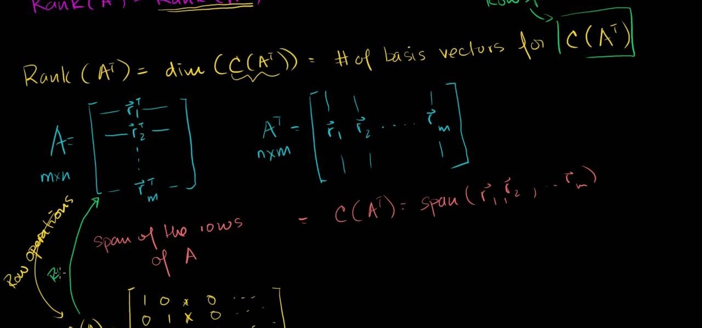

### *```developed by ovctech in July 2023```*


# Introduction


This repository is dedicated to the s21_matrix library, which implements matrices and mathematical operations on them in the C++ programming language.




# How to run

> Prerequirements:

```Ubuntu/MacOS like system```
___


> Install dependices:

* Ubuntu-like systems:
```bash
sudo apt install -y g++ build-essential libgtest-dev cmake lcov clang-format cppcheck valgrind && cd /usr/src/googletest && sudo cmake . && sudo make && sudo cp lib/*.a /usr/lib && cd -
```

* MacOS-like systems:
```bash
brew install gcc cmake lcov clang-format cppcheck valgrind googletest && cd /usr/local/Cellar/googletest/*/lib && sudo cp *.a /usr/local/lib && cd -
```
___
> Run:
```bash
make
```


# Under hood


Matrix is a rectangular table of numbers arranged in m rows and n columns

```
    1 2 3
A = 4 5 6
    7 8 9
```

```
     1  2  3  4
В =  5  6  7  8
     9 10 11 12
```

You can get the desired element using indices as follows A[1,1] = 1, where the first index is the row number, the second is the column number.

The order of a matrix is the number of its rows or columns. \
The main diagonal of a square matrix is the diagonal from the upper left to the lower right corner. \

A rectangular matrix (B) is a matrix with the number of rows not equal to the number of columns. \
A square matrix (A) is a matrix with the number of rows equal to the number of columns.

# Realized functions

### Matrix operations

| Operation | Description | Exceptional situations |
| ----------- | ----------- | ----------- |
| `bool EqMatrix(const S21Matrix& other)` | Checks matrices for equality with each other |  |
| `void SumMatrix(const S21Matrix& other)` | Adds the second matrix to the current one | different matrix dimensions |
| `void SubMatrix(const S21Matrix& other)` | Subtracts another matrix from the current one | different matrix dimensions |
| `void MulNumber(const double num) ` | Multiplies the current matrix by a number |  |
| `void MulMatrix(const S21Matrix& other)` | Multiplies the current matrix by the second matrix | the number of columns of the first matrix is not equal to the number of rows of the second matrix |
| `S21Matrix Transpose()` | Creates a new transposed matrix from the current one and returns it |  |
| `S21Matrix CalcComplements()` | Calculates the algebraic addition matrix of the current one and returns it | the matrix is not square |
| `double Determinant()` | Calculates and returns the determinant of the current matrix | the matrix is not square |
| `S21Matrix InverseMatrix()` | Calculates and returns the inverse matrix | matrix determinant is 0 |


### Сonstructors and destructors

| Method | Description |
| ----------- | ----------- |
| `S21Matrix()` | A basic constructor that initialises a matrix of some predefined dimension |  
| `S21Matrix(int rows, int cols) ` | Parametrized constructor with number of rows and columns |
| `S21Matrix(const S21Matrix& other)` | Copy constructor |
| `S21Matrix(S21Matrix&& other)` | Move constructor |
| `~S21Matrix()` | Destructor |

### Operators

| Operator | Description | Exceptional situations |
| ----------- | ----------- | ----------- |
| `+`      | Addition of two matrices | different matrix dimensions |
| `-`   | Subtraction of one matrix from another | different matrix dimensions |
| `*`  | Matrix multiplication and matrix multiplication by a number | the number of columns of the first matrix does not equal the number of rows of the second matrix |
| `==`  | Checks for matrices equality (`EqMatrix`) | |
| `=`  | Assignment of values from one matrix to another one | |
| `+=`  | Addition assignment (`SumMatrix`) | different matrix dimensions |
| `-=`  | Difference assignment (`SubMatrix`) | different matrix dimensions |
| `*=`  | Multiplication assignment (`MulMatrix`/`MulNumber`) | the number of columns of the first matrix does not equal the number of rows of the second matrix |
| `(int i, int j)`  | Indexation by matrix elements (row, column) | index is outside the matrix |
